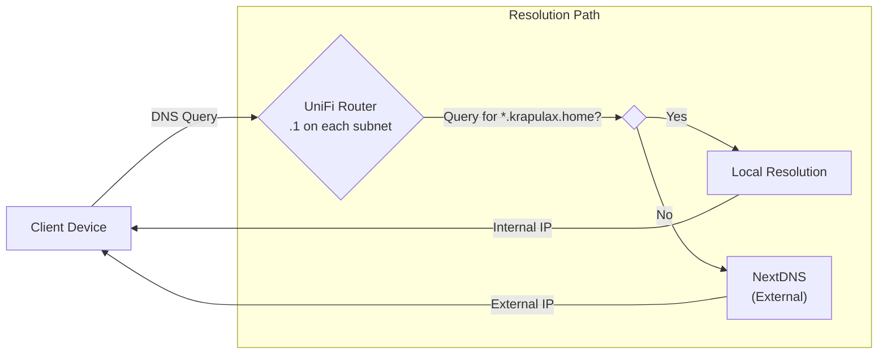

# DNS Strategy

This document outlines the DNS strategy for the homelab network. The approach prioritizes simplicity by using the Unifi router as the internal resolver with NextDNS as the upstream provider for ad-blocking and privacy.

## DNS Resolution Flow

All clients use the Unifi router as their DNS server. The router handles internal domain resolution and forwards external queries to NextDNS.



The resolution path is as follows:
1. **Client Device** sends a DNS query to the Unifi router (`.1` on their subnet).
2. If the query is for the internal `krapulax.home` domain, the router resolves it locally.
3. For all other queries, the router forwards them to **NextDNS** for resolution with ad-blocking and privacy filtering.

## Unifi Router as DNS Server

Each network uses its gateway as the DNS server:

| Network | DNS Server |
|---------|------------|
| Default (192.168.1.0/24) | `192.168.1.1` |
| USER (10.0.10.0/24) | `10.0.10.1` |
| IOT (10.0.20.0/24) | `10.0.20.1` |
| DEV-INFRA (10.0.30.0/24) | `10.0.30.1` |
| PROD-INFRA (10.0.40.0/24) | `10.0.40.1` |
| GUEST (10.0.80.0/24) | `10.0.80.1` |

## Upstream DNS (NextDNS)

The Unifi router is configured to forward external DNS queries to **NextDNS**, a cloud-based DNS service that provides:

- **Ad-blocking**: Network-wide advertisement filtering
- **Privacy**: Tracker blocking and encrypted DNS
- **Security**: Malware and phishing protection
- **Analytics**: Query logging and insights (optional)

NextDNS is configured in the UDM-PRO under **Settings → Internet → WAN → DNS Server**.

## Internal DNS

Internal network resolution for the `krapulax.home` domain is managed directly by the UniFi router. DNS records are provisioned via Terraform in the [homelab-terraform-unifi](https://github.com/fabricesemti80/homelab-terraform-unifi) repository.

Key internal DNS records:

| Hostname | IP Address | Type |
|----------|------------|------|
| `pve-0.krapulax.home` | `10.0.40.10` | A |
| `pve-1.krapulax.home` | `10.0.40.11` | A |
| `pve-2.krapulax.home` | `10.0.40.12` | A |
| `swarm.krapulax.home` | `10.0.40.40` | A |
| `portainer.krapulax.home` | → swarm | CNAME |
| `homepage.krapulax.home` | → swarm | CNAME |
| `traefik.krapulax.home` | → swarm | CNAME |

## Public DNS

For services accessible from the internet, the domain `krapulax.dev` is used. DNS records are managed through Cloudflare, with traffic routed via Cloudflare Tunnels.

## Verification

To verify DNS resolution is working correctly:

```sh
# Test internal resolution
dig @10.0.40.1 pve-0.krapulax.home

# Test external resolution (should show NextDNS filtering)
dig @10.0.40.1 example.com
```

A successful internal query will show the internal IP:

```
;; ANSWER SECTION:
pve-0.krapulax.home.	0	IN	A	10.0.40.10
```
