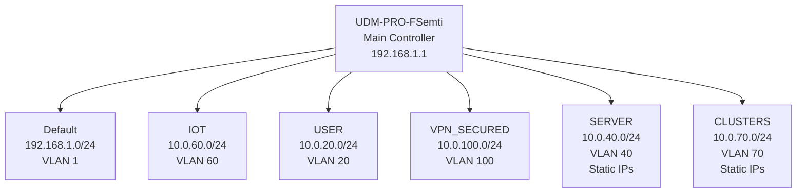

# Network Documentation

This document describes the physical network setup in the homelab, including the Unifi Dream Machine Pro (UDM-PRO-FSemti) controller and the configured VLANs/networks.

## Overview

The primary network device is the Unifi Dream Machine Pro (UDM-PRO-FSemti), which serves as the main router, firewall, and controller for the homelab network. It manages multiple VLANs for different purposes.

## Network Configuration

| Network Name | VLAN ID | Device | Subnet | Purpose | DHCP Range |
|--------------|---------|--------|--------|---------|------------|
| Default | 1 | UDM-PRO-FSemti | 192.168.1.0/24 | Main network | 192.168.1.8 - 192.168.1.249 |
| IOT | 60 | UDM-PRO-FSemti | 10.0.60.0/24 | IoT devices | 10.0.60.6 - 10.0.60.231 |
| USER | 20 | UDM-PRO-FSemti | 10.0.20.0/24 | User devices | 10.0.20.14 - 10.0.20.191 |
| VPN_SECURED | 100 | UDM-PRO-FSemti | 10.0.100.0/24 | VPN secured access | 10.0.100.0 - 10.0.100.195 |
| SERVER | 40 | UDM-PRO-FSemti | 10.0.40.0/24 | Server infrastructure | None (static IPs) |
| CLUSTERS | 70 | UDM-PRO-FSemti | 10.0.70.0/24 | Kubernetes clusters | None (static IPs) |

## Network Diagram

