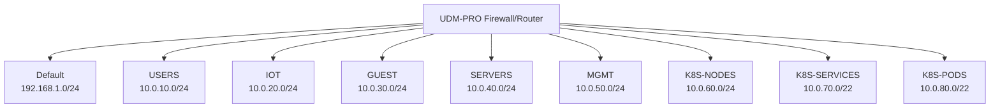

# Network Documentation

This document describes the network setup in the homelab. The network architecture aims to use K.I.S.S. principles. The central point of the system is the Unifi-based firewall and switch.

## Networks

The following networks are present:

| VLAN id | VLAN name | Subnet CIDR | DFGW | DHCP allowed | DHCP Scope | DNS servers | FW rules |
|---|---|---|---|---|---|---|---|
| Default | 192.168.1.0/24 | 192.168.1.1 | True | 192.168.1.1 - 192.168.1.254 | 192.168.1.1 | ALLOW ALL |
10 | USERS | 10.0.10.0/24 | 10.0.10.1 | True | 10.0.10.10 - 10.0.10.250 | 10.0.10.1 | ALLOW ALL |
20 | IOT | 10.0.20.0/24 | 10.0.20.1 | True | 10.0.20.10 - 10.0.20.250 | 208.67.222.222, 208.67.220.220 | ISOLATED |
30 | GUEST | 10.0.30.0/24 | 10.0.30.1 | True | 10.0.30.10 - 10.0.30.250 | 208.67.222.222, 208.67.220.220 | ISOLATED |
40 | SERVERS | 10.0.40.0/24 | 10.0.40.1 | False | | 10.0.40.1 | ALLOWED from USERS, SERVERS, MGMT |
50 | MGMT | 10.0.50.0/24 | 10.0.50.1 | False | | 10.0.50.1 | ALLOWED from USERS |
60 | K8S-NODES | 10.0.60.0/24 | 10.0.60.1 | False | | 10.0.60.1 | ALLOWED from USERS, SERVERS, MGMT |
70 | K8S-SERVICES | 10.0.70.0/22 | | | | | |
80 | K8S-PODS | 10.0.80.0/22 | | | | | |

## Network Diagram

## DNS

The DNS strategy for the homelab is designed to provide a balance of security, privacy, and performance. For a detailed description of the DNS configuration, please refer to the [DNS Strategy](dns.md) document.

The main points are as follows:

*   **Upstream DNS:** The primary DNS provider is NextDNS, configured directly on the Unifi Dream Machine. This provides filtering and analytics for all DNS traffic that passes through the router.
*   **Internal DNS:** Most networks and VLANs use the Unifi Dream Machine as their DNS resolver. While the router IP (e.g., `10.0.10.1`) is configured as the DNS server in the network settings, the router itself forwards all DNS requests to NextDNS, providing a unified filtering layer.
*   **Exceptions:** The `GUEST` and `IOT` networks are configured to use OpenDNS servers directly. This is done to isolate the traffic from these networks and to provide an additional layer of security.
*   **Domain Names:** The internal domain `krapulax.home` is used for internal services, while the public domain `krapulax.dev` is used for services exposed to the internet.