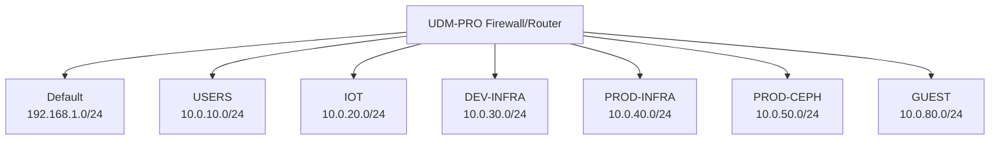

# Network Documentation

This document describes the network setup in the homelab. The network architecture aims to use K.I.S.S. principles. The central point of the system is the Unifi-based firewall and switch.

## Networks

The following networks are present. VLAN IDs correspond to the third octet of the subnet.

| VLAN id | Network Name | Subnet CIDR    | Description                                 | DNS Servers                          | FW Rules    |
| ------- | ------------ | -------------- | ------------------------------------------- | ------------------------------------ | ----------- |
| 1       | Default      | 192.168.1.0/24 | Management LAN (Unifi Devices)              | `192.168.1.1` (Router)               | Allow All   |
| 10      | USERS        | 10.0.10.0/24   | Trusted devices (Laptops, Phones)           | `10.0.10.1` (Router)                 | Allow All   |
| 20      | IOT          | 10.0.20.0/24   | IoT Devices                                 | `208.67.222.222` `208.67.220.220` | Isolated    |
| 30      | DEV-INFRA    | 10.0.30.0/24   | Development Infrastructure (K8s Nodes/Pods) | `10.0.30.1` (Router)                 | Restricted  |
| 40      | PROD-INFRA   | 10.0.40.0/24   | Production Infrastructure                   | `10.0.40.1` (Router)                 | Restricted  |
| 50      | PROD-CEPH    | 10.0.50.0/24   | Dedicated Storage Cluster Network           | -                                    | No Internet |
| 80      | GUEST        | 10.0.80.0/24   | Guest Network                               | `208.67.222.222` `208.67.220.220` | Isolated    |

## Network Diagram

## DNS Strategy

For a comprehensive overview of the DNS configuration, see the [DNS Strategy](dns.md) document.

The DNS strategy balances security, privacy, and performance.

### Standard Configuration (NextDNS)
For most networks (`Default`, `USERS`, `DEV-INFRA`, `PROD-INFRA`), the DNS server provided via DHCP is the **Router's IP address** for that specific subnet (e.g., `10.0.10.1`).

The Router (UDM-PRO) is configured to forward these requests to **NextDNS** as the upstream provider.
*   **NextDNS Upstream IPs**:
    *   `45.90.28.45`
    *   `45.90.30.45`

### Exceptions (OpenDNS)
The `IOT` and `GUEST` networks bypass the internal resolver to ensure isolation. Clients on these networks are assigned **OpenDNS** servers directly via DHCP.
*   **OpenDNS IPs**:
    *   `208.67.222.222`
    *   `208.67.220.220`

### Domain Resolution
*   **Internal**: `krapulax.home` (Managed by UDM-PRO)
*   **Public**: `krapulax.dev` (Managed by Cloudflare)
